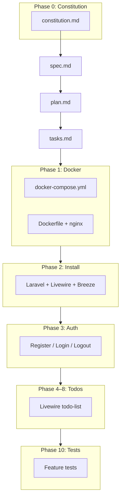

# BMAD + Spec Kit: Combined SDD Workflow

Todo list demo using **GitHub Spec Kit** artifacts and **BMAD** agent roles. Stack: **TALL** (Tailwind, Alpine, Laravel, Livewire) in **Docker** with **registration/login**.

## The Two Frameworks

| Aspect | Spec Kit | BMAD |
|--------|----------|------|
| **Focus** | Structured markdown artifacts + slash commands | Role-based AI agents simulating a dev team |
| **Workflow** | Constitution → Specify → Plan → Tasks → Implement | Analysis → Planning → Solutioning → Implementation → QA |
| **Strength** | Agent-agnostic, lightweight, GitHub-native | Deep role separation, enterprise audit trail |
| **Artifacts** | `.specify/`, `specs/NNN-feature/` | Agent outputs mapped to same folders |

## End-to-End Flow (This Project)



### Phase 0: Constitution (`/speckit.constitution`)

**BMAD**: Product Manager + Architect  
**Output**: `.specify/memory/constitution.md`

Defines TALL stack, Docker-first dev, auth-before-features, test gates.

### Phase 1: Specify (`/speckit.specify`)

**BMAD**: Analyst → PM  
**Output**: `specs/001-todo-app/spec.md`

User stories US0 (auth) through US4 (delete), FR-xxx, SC-xxx. No implementation detail.

### Phase 2: Plan (`/speckit.plan`)

**BMAD**: Architect  
**Output**: `specs/001-todo-app/plan.md`

Docker services, Breeze Livewire auth, data model, routes, ADRs.

### Phase 3: Tasks (`/speckit.tasks`)

**BMAD**: Scrum Master  
**Output**: `specs/001-todo-app/tasks.md`

Phased checklist:

1. Docker setup  
2. Project install  
3. Registration, login, base flow  
4. Todo schema + CRUD  
5. Tests  

### Phase 4: Implement (`/speckit.implement`)

**BMAD**: Developer  
**Output**: Application code in repo root

Execute `tasks.md` in order; mark tasks `[x]` as completed.

### Phase 5: QA Gate

**BMAD**: QA Engineer  

```bash
make test
# or
docker compose exec app php artisan test
```

Verify each Given/When/Then in `spec.md`.

## Spec Kit Commands (Cursor)

Invoke in Agent chat:

| Command | Purpose |
|---------|---------|
| `/speckit.constitution` | Create/update governing principles |
| `/speckit.specify` | Write feature spec from description |
| `/speckit.plan` | Generate technical plan from spec |
| `/speckit.tasks` | Break plan into executable tasks |
| `/speckit.implement` | Execute tasks and build feature |

Skills live in `.cursor/skills/speckit-*/SKILL.md`.

## BMAD Agent Personas

| Agent | When | Prompt prefix |
|-------|------|---------------|
| Analyst | Clarify requirements | "Act as BMAD Analyst:" |
| PM | Prioritize, constitution | "Act as BMAD Product Manager:" |
| Architect | Plan, Docker, ADRs | "Act as BMAD Architect:" |
| Developer | Implement tasks.md | "Act as BMAD Developer, follow spec:" |
| QA | Acceptance verification | "Act as BMAD QA, verify spec scenarios:" |

See [agents.md](./agents.md) for full prompt templates.

## Artifact Trail

```
.specify/memory/constitution.md
specs/001-todo-app/spec.md
specs/001-todo-app/plan.md
specs/001-todo-app/tasks.md
docker-compose.yml
docker/php/Dockerfile
app/Models/Todo.php
resources/views/livewire/todo-list.blade.php
tests/Feature/TodoListTest.php
tests/Feature/Auth/
```

## Recommended Session Order

1. Read constitution → spec → plan → tasks  
2. `/speckit.implement` Phase 1–2 (Docker + install)  
3. `/speckit.implement` Phase 3 (auth) — manual smoke test  
4. `/speckit.implement` Phase 4–8 (todos)  
5. `/speckit.implement` Phase 10 (tests)  
6. BMAD QA pass against `spec.md`
