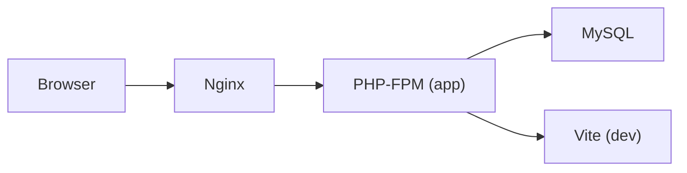

# Implementation Plan: Todo List (TALL Stack + Docker)

**Branch**: `001-todo-app` | **Date**: 2026-07-09 | **Spec**: [spec.md](./spec.md)  
**Status**: Draft

## Summary

Authenticated todo manager: Docker Compose (Nginx + PHP-FPM + MySQL), Laravel with Breeze (Livewire stack), single Livewire todo component scoped per user. Feature tests for auth and todos run in-container.

## Technical Context

**Language/Version**: PHP 8.3+, Laravel 12  
**Primary Dependencies**: livewire/livewire, laravel/breeze, tailwindcss ^4, vite  
**Storage**: MySQL 8 (`DB_HOST=mysql` in Docker)  
**Testing**: PHPUnit 11+ feature tests (SQLite in-memory for speed in CI, MySQL in Docker for dev)  
**Target Platform**: Docker Compose local dev  
**Project Type**: Web monolith  
**Performance Goals**: Sub-300ms Livewire round-trips locally  
**Constraints**: No API layer, no queues — learning demo scope

## Constitution Check

| Principle | Compliance |
|-----------|------------|
| Spec-first | ✅ Artifacts before code |
| TALL stack | ✅ Breeze Livewire + Alpine + Tailwind + Laravel |
| Docker-first | ✅ compose file for all services |
| Auth before features | ✅ Breeze before todo component |
| Test-driven | ✅ Auth + todo feature tests |
| Simplicity | ✅ Single Livewire SFC, one extra migration |

## Project Structure

```text
learning_2/
├── docker/
│   ├── nginx/default.conf
│   └── php/Dockerfile
├── docker-compose.yml
├── Makefile                         # convenience wrappers
├── app/Models/
│   ├── User.php
│   └── Todo.php
├── database/migrations/
│   ├── *_create_users_table.php     # Breeze
│   └── *_create_todos_table.php
├── resources/views/
│   ├── components/layouts/app.blade.php
│   ├── livewire/
│   │   └── todo-list.blade.php      # Livewire SFC (or ⚡ prefix)
│   └── todos/index.blade.php
├── routes/web.php
├── tests/Feature/
│   ├── Auth/                        # Breeze-generated + custom
│   └── TodoListTest.php
├── specs/001-todo-app/
├── .specify/memory/constitution.md
└── docs/bmad/
```

## Docker Architecture



| Service | Image | Port | Purpose |
|---------|-------|------|---------|
| `nginx` | nginx:alpine | 8080 → 80 | Web server |
| `app` | Custom PHP 8.3-FPM | — | Laravel, Artisan, Composer |
| `mysql` | mysql:8.0 | 3306 | Primary database |
| `node` | node:22-alpine | 5173 | Vite dev server (profile: dev) |

### ADR-001: Docker Compose over Sail
Use a minimal custom compose file for learning clarity. Laravel Sail is acceptable alternative but this plan uses explicit services in `docker/` for transparency.

### ADR-002: Laravel Breeze (Livewire)
Breeze scaffolds register/login/logout with Livewire views — matches TALL stack without Jetstream overhead.

### ADR-003: User-Scoped Todos
All todo queries use `auth()->user()->todos()`. Route model binding scoped via `TodoPolicy` or explicit `where user_id`.

### ADR-004: Livewire Single-File Component
One `todo-list` component handles CRUD + filtering. Auth layout wraps the page.

## Data Model

```sql
-- users: Laravel default (Breeze migration)

CREATE TABLE todos (
    id BIGINT UNSIGNED PRIMARY KEY AUTO_INCREMENT,
    user_id BIGINT UNSIGNED NOT NULL,
    title VARCHAR(255) NOT NULL,
    description TEXT NULL,
    completed BOOLEAN DEFAULT FALSE,
    priority ENUM('low','medium','high') DEFAULT 'medium',
    position SMALLINT UNSIGNED DEFAULT 0,
    created_at TIMESTAMP NULL,
    updated_at TIMESTAMP NULL,
    FOREIGN KEY (user_id) REFERENCES users(id) ON DELETE CASCADE
);
```

## Routes

| Method | Path | Middleware | Handler |
|--------|------|------------|---------|
| GET | `/` | guest | Welcome or redirect |
| GET/POST | `/register` | guest | Breeze registration |
| GET/POST | `/login` | guest | Breeze login |
| POST | `/logout` | auth | Breeze logout |
| GET | `/todos` | auth | `todos.index` + `<livewire:todo-list />` |
| GET | `/dashboard` | auth | Optional Breeze dashboard → redirect `/todos` |

## Environment (.env)

```dotenv
APP_URL=http://localhost:8080
DB_CONNECTION=mysql
DB_HOST=mysql
DB_PORT=3306
DB_DATABASE=todo_app
DB_USERNAME=todo
DB_PASSWORD=secret
```

## BMAD Phase Mapping

| BMAD Phase | Agent | Output |
|------------|-------|--------|
| Analysis | Analyst | `spec.md` |
| Planning | PM + Architect | `plan.md`, constitution |
| Solutioning | Architect | Docker files, data model, ADRs |
| Implementation | Dev | Breeze, Livewire, migrations |
| QA | QA Agent | Feature tests |

## Implementation Order

1. **Docker** — compose, Dockerfile, nginx config, Makefile
2. **Project install** — `composer create-project`, Livewire, Breeze, npm build
3. **Auth base flow** — register, login, logout, protected routes
4. **Todo CRUD** — migration, model, Livewire component
5. **Tests** — auth smoke + todo feature tests
