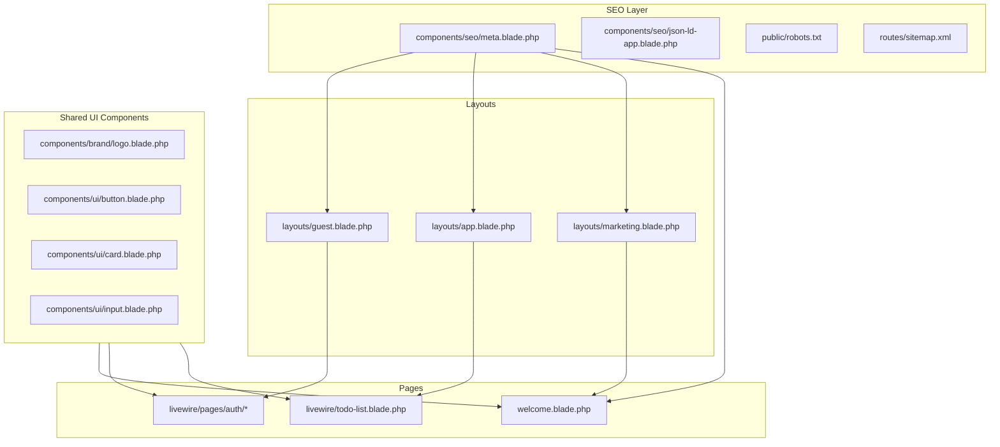

# Implementation Plan: Frontend Redesign + SEO

**Branch**: `002-frontend-redesign` | **Date**: 2026-07-09 | **Spec**: [spec.md](./spec.md)  
**Status**: Draft

## Summary

Unify the todo app’s visual identity with a **2026 “Electric Twilight + Cloud Dancer”** design system (Tailwind 4 CSS variables), shared Blade UI components, and a **centralized SEO layer** (meta tags, OG/Twitter, JSON-LD, robots + sitemap). No backend or database changes — presentation and discoverability only. Existing todo Livewire logic stays intact.

## Technical Context

**Language/Version**: PHP 8.3+, Laravel 13  
**Primary Dependencies**: tailwindcss ^4, vite, livewire ^3, laravel/breeze (existing)  
**Storage**: None (UI-only feature)  
**Testing**: Existing PHPUnit suite (34 tests) + optional SEO smoke assertions  
**Target Platform**: Docker Compose (`http://localhost:8081`)  
**Project Type**: Web monolith (Blade + Livewire)  
**Performance Goals**: Lighthouse SEO ≥ 90 on `/`; no new render-blocking assets  
**Constraints**: Tailwind-only styling; no new npm UI libraries; no dark-mode toggle in v1

## Constitution Check

| Principle | Compliance |
|-----------|------------|
| Spec-first | ✅ Implements approved `002-frontend-redesign/spec.md` |
| TALL stack | ✅ Tailwind tokens + Alpine; Livewire unchanged |
| Docker-first | ✅ Build via `make build`; test via `make test` |
| Auth before features | ✅ N/A — visual refresh only |
| Test-driven | ✅ Full suite must stay green |
| Simplicity | ✅ Shared components, one SEO partial, static OG image |

## Open Questions — Decisions (ADR summary)

| Question | Decision | Rationale |
|----------|----------|-----------|
| OG image | Static `public/og-image.png` (1200×630) | Simple, no build pipeline; works with all social crawlers |
| Font | Keep **Figtree**; add **Instrument Sans** or stay Figtree-only | Figtree already loaded; avoid FOUT — extend weights to 700 for headings |
| Dark mode | **Mood-dark hero band only** on landing; no global toggle | Spec FR-006; defers complexity |

---

## Design System (Tailwind 4)

Define tokens in `resources/css/app.css` using `@theme` (Tailwind v4):

```css
@theme {
  /* Cloud Dancer — warm neutrals */
  --color-surface: oklch(0.98 0.008 85);
  --color-surface-elevated: oklch(1 0 0);
  --color-muted: oklch(0.55 0.02 85);

  /* Electric Twilight — primary scale */
  --color-primary-600: oklch(0.45 0.18 280);   /* deep indigo-violet */
  --color-primary-500: oklch(0.52 0.20 280);
  --color-primary-50: oklch(0.97 0.03 280);

  /* Secondary — cyan/teal */
  --color-secondary-500: oklch(0.65 0.12 200);

  /* Accent — magenta micro-glow (CTAs, focus) */
  --color-accent-500: oklch(0.58 0.22 340);

  /* Dark accent surfaces */
  --color-ink: oklch(0.15 0.01 280);
}
```

Utility mapping (examples):

| Token | Tailwind usage |
|-------|----------------|
| Surface | `bg-surface`, `bg-surface-elevated` |
| Primary | `bg-primary-600`, `text-primary-600`, `ring-primary-500` |
| Secondary | `text-secondary-500`, gradient stops |
| Accent | `bg-accent-500`, `shadow-accent-500/25` |
| Ink | `bg-ink` (hero footer band) |

**Gradients**: Pure CSS in `@layer utilities` — mesh hero via multi-stop `background-image` radials (no external images).

**Motion**: Wrap transitions in `@media (prefers-reduced-motion: no-preference)`.

---

## Architecture



---

## SEO Implementation

### Central meta component

**File**: `resources/views/components/seo/meta.blade.php`

Props: `title`, `description`, `canonical`, `ogImage` (default `/og-image.png`), `robots` (optional).

Renders:
- `<title>{title} — {app.name}</title>` (or full title if passed with suffix flag)
- `<meta name="description">`
- `<link rel="canonical">`
- Open Graph: `og:title`, `og:description`, `og:url`, `og:type`, `og:image`, `og:site_name`
- Twitter: `twitter:card` (summary_large_image), `twitter:title`, `twitter:description`, `twitter:image`

### JSON-LD

**File**: `resources/views/components/seo/json-ld-app.blade.php`

Included on landing only:

```json
{
  "@context": "https://schema.org",
  "@type": "WebApplication",
  "name": "Todo App",
  "applicationCategory": "ProductivityApplication",
  "operatingSystem": "Web",
  "offers": { "@type": "Offer", "price": "0", "priceCurrency": "USD" }
}
```

### Crawl files

| File | Approach |
|------|----------|
| `public/robots.txt` | Static: `Allow: /`, `Sitemap: {APP_URL}/sitemap.xml` |
| `public/sitemap.xml` | Static XML with `/`, `/login`, `/register` + `lastmod` |
| `public/og-image.png` | Static 1200×630 branded image (gradient + logo + tagline) |

**Optional route** (if dynamic APP_URL needed): `Route::get('/sitemap.xml', SitemapController)` — prefer static for demo simplicity.

### Per-page SEO matrix

| Route | Title (example) | Description focus |
|-------|-------------------|-------------------|
| `/` | Organize your day with Todo App | Free task manager, TALL stack demo |
| `/login` | Log in to Todo App | Access your personal task list |
| `/register` | Create your Todo App account | Sign up free, manage daily tasks |
| `/todos` | My Tasks | (auth-only; no meta description for crawlers) |

---

## Shared UI Components

| Component | Path | Replaces |
|-----------|------|----------|
| Brand logo | `components/brand/logo.blade.php` | `application-logo` on marketing/auth |
| Primary button | `components/ui/button.blade.php` | `primary-button` (extend, don’t delete Breeze refs yet) |
| Card | `components/ui/card.blade.php` | Ad-hoc `rounded-2xl border` blocks |
| Text input | `components/ui/input.blade.php` | Wrap `text-input` with 2026 ring/focus styles |
| Marketing layout | `layouts/marketing.blade.php` | Inline `<html>` in `welcome.blade.php` |

**Strategy**: Create new `ui/*` components; gradually wire auth pages. Keep Breeze component names working via thin wrappers or direct class updates in `primary-button.blade.php` / `text-input.blade.php` to minimize diff.

---

## Page-by-Page Changes

### 1. Landing (`welcome.blade.php`)

- Extract to `layouts/marketing.blade.php` with `<x-seo.meta>` + JSON-LD
- Hero: mesh gradient background (CSS), warm `surface` base, accent CTA (`accent-500` glow shadow)
- Replace emoji feature cards with `x-ui.card`
- Dark “ink” band for Spec Kit / stack section (FR-006)
- Remove duplicate inline fonts — layout owns head
- Semantic: one `<h1>`, `<main>`, `<footer>`

### 2. Guest layout (`layouts/guest.blade.php`)

- Background: `bg-surface` + subtle mesh gradient
- Logo: `<x-brand.logo>` linking to `/`
- Card: `x-ui.card` with elevated surface
- Accept SEO props via `@section` or layout slot for login/register Volt pages

### 3. Auth Volt pages (`livewire/pages/auth/login.blade.php`, `register.blade.php`)

- Headings: product copy, not generic “Login” only
- Inputs/buttons use updated Breeze components (2026 tokens)
- Match landing button radius (`rounded-xl`) and accent focus rings

### 4. App layout (`layouts/app.blade.php` + `navigation.blade.php`)

- Nav: cream/white bar, primary logo, accent on active link
- Page background: `bg-surface` gradient (match marketing)
- `<x-seo.meta title="My Tasks">` in todos index

### 5. Todo list (`livewire/todo-list.blade.php`)

- Swap hardcoded `indigo-*` → `primary-*` / `accent-*` / `surface-*`
- Stat cards: soft-glow hover, secondary accent on active filter
- Empty states: warm illustration circle + copy (already partial — refine tokens)
- Ensure completed text uses `text-muted` not low-opacity (NFR-001)

### 6. Welcome navigation (`livewire/welcome/navigation.blade.php`)

- Align button styles with `x-ui.button` variants

---

## Project Structure (delta)

```text
learning_2/
├── public/
│   ├── og-image.png              # NEW — social preview
│   ├── robots.txt                # UPDATE
│   └── sitemap.xml               # NEW
├── resources/
│   ├── css/app.css               # UPDATE — @theme tokens, mesh utilities
│   └── views/
│       ├── components/
│       │   ├── brand/logo.blade.php
│       │   ├── seo/meta.blade.php
│       │   ├── seo/json-ld-app.blade.php
│       │   └── ui/{button,card,input}.blade.php
│       ├── layouts/
│       │   └── marketing.blade.php   # NEW
│       ├── welcome.blade.php         # REFACTOR
│       ├── layouts/guest.blade.php   # UPDATE
│       ├── layouts/app.blade.php     # UPDATE
│       └── livewire/...              # TOKEN SWAP
├── tests/Feature/
│   └── SeoTest.php                   # NEW — optional P2
└── specs/002-frontend-redesign/
    ├── spec.md
    └── plan.md                       # this file
```

---

## ADRs

### ADR-001: Tailwind `@theme` over SCSS variables

Use Tailwind 4 native theme extension in `app.css`. Keeps constitution “Tailwind only” and enables OKLCH tokens for 2026 perceptual palettes.

### ADR-002: Blade SEO component over spatie/laravel-meta

No new dependency. Demo scope; `<x-seo.meta>` is ~40 lines and sufficient for FR-007–FR-014.

### ADR-003: Static sitemap/robots over package

Avoid `spatie/laravel-sitemap` for three URLs. Static files version-controlled and zero runtime cost.

### ADR-004: Update Breeze primitives in-place

Modify `primary-button`, `text-input`, `nav-link` class strings rather than forking Breeze. Lowest risk for Livewire Volt compatibility.

### ADR-005: OKLCH with sRGB fallbacks

Define tokens in OKLCH; Tailwind 4 handles wide-gamut where supported. Validate contrast pairs manually for primary-600 on surface and accent-500 on white.

---

## Implementation Order

```text
Phase 1: Design tokens + mesh utilities (app.css) + npm build
Phase 2: SEO layer (meta component, JSON-LD, robots, sitemap, og-image)
Phase 3: Shared UI components (logo, button, card, input)
Phase 4: Marketing layout + landing refactor
Phase 5: Guest layout + auth pages styling
Phase 6: App layout + navigation + todos token swap
Phase 7: QA — Lighthouse SEO, contrast check, php artisan test
```

---

## Testing Plan

| Check | Command / method |
|-------|------------------|
| Regression | `docker compose exec app php artisan test` — 34 tests green |
| SEO smoke (new) | `tests/Feature/SeoTest.php`: GET `/` contains `og:title`, `application/ld+json`; GET `/robots.txt` 200; GET `/sitemap.xml` 200 |
| Lighthouse | Chrome DevTools on `/` (production Vite build) — SEO ≥ 90 |
| Visual QA | Manual: landing → register → todos palette consistency |
| a11y | axe DevTools or manual contrast on primary/accent pairs |

---

## BMAD Phase Mapping

| Phase | Agent | Deliverable |
|-------|-------|-------------|
| Planning | Architect | This `plan.md` |
| Solutioning | Architect | Design tokens, component list, ADRs |
| Implementation | Dev | Blade/CSS changes per phases 1–6 |
| QA | QA Engineer | Lighthouse + test suite + spec acceptance |

---

## Risks & Mitigations

| Risk | Mitigation |
|------|------------|
| OKLCH unsupported in old browsers | Tailwind emits sRGB equivalents; test in Safari/Firefox |
| Breeze upgrade overwrites views | Document customized files; minimal Volt edits |
| OG image caching | Version filename `og-image.png?v=2` or cache-bust on deploy |
| Tailwind class purge misses dynamic classes | Use full token names in `@theme`, avoid string-built classes |

---

## Next Step

Run `/speckit.tasks` to generate phased checklist, then `/speckit.implement`.
