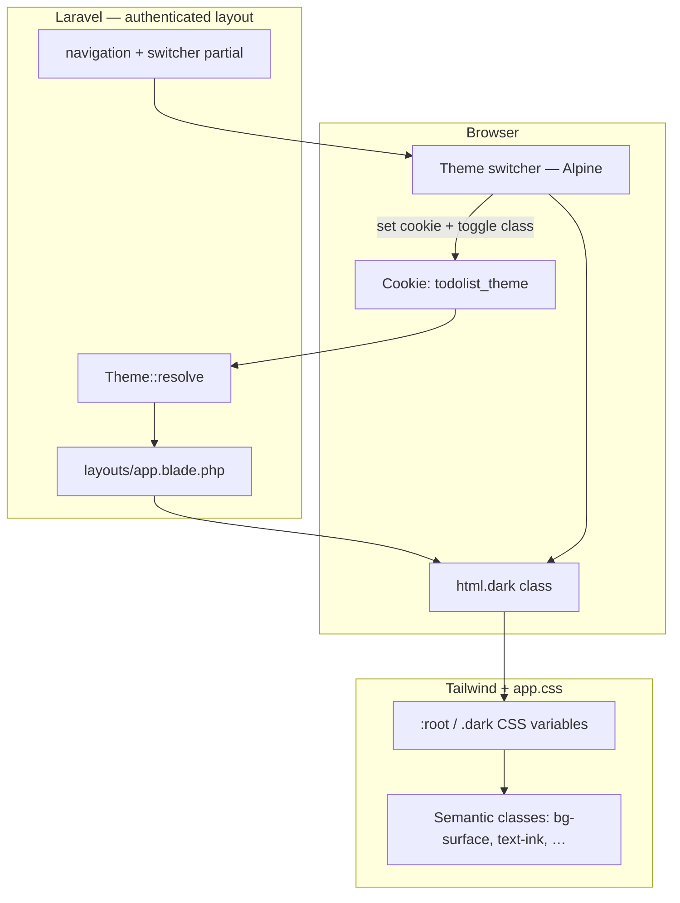

# Implementation Plan: Light / Dark Theme Switcher (Authenticated)

**Branch**: `003-theme-switcher` | **Date**: 2026-07-12 | **Spec**: [spec.md](./spec.md)  
**Status**: Draft

## Summary

Add a **light / dark theme switcher** for authenticated users only. **Light** preserves the current 2026 redesign tokens unchanged. **Dark** applies a **Monokai-inspired** palette. Preference persists in a **browser cookie** (`todolist_theme=light|dark`), read server-side on each authenticated request and mirrored client-side via Alpine for instant toggling. No database migrations, no new routes, no Docker changes — presentation + cookie handling only.

## Technical Context

**Language/Version**: PHP 8.3+, Laravel 12  
**Primary Dependencies**: tailwindcss ^3, vite, livewire ^3, alpine (via Livewire)  
**Storage**: None — cookie-only preference (`todolist_theme`)  
**Testing**: PHPUnit feature tests + existing suite must stay green  
**Target Platform**: Docker Compose (`http://localhost:8081`)  
**Project Type**: Web monolith (Blade + Livewire)  
**Performance Goals**: No flash of wrong theme on authenticated load (SC-008)  
**Constraints**: Tailwind-only styling; Alpine for toggle; no new npm UI libraries; guest pages unchanged

## Constitution Check

| Principle | Compliance |
|-----------|------------|
| Spec-first | ✅ Implements `003-theme-switcher/spec.md` |
| TALL stack | ✅ Tailwind `darkMode: 'class'` + Alpine toggle; Livewire unchanged for todos |
| Docker-first | ✅ Build via `make build`; test via `make test` |
| Auth before features | ✅ Switcher only on auth-gated layouts (`app` layout) |
| Test-driven | ✅ New `ThemeSwitcherTest.php`; full suite green |
| Simplicity | ✅ One Theme helper, one Blade partial, CSS variable swap |

## Open Questions — Decisions (ADR summary)

| Question | Decision | Rationale |
|----------|----------|-----------|
| Cookie name & expiry | `todolist_theme`, **1 year** `max-age`, `path=/`, `SameSite=Lax` | App-specific name; survives sessions; not deleted on logout (FR-013) |
| Switcher UX | **Segmented control** — sun icon “Light” / moon icon “Dark” | Accessible labels; ≤2 taps (SC-001); clearer than icon-only |
| FOUC prevention | **Server cookie read** on `<html class="dark">` **plus** tiny inline blocking script in `app` layout head | Server handles SSR; inline script covers edge race before CSS paint |
| Dark mesh backgrounds | **Subtle dark mesh** on `#272822` base — low-opacity Monokai accent radials | Keeps visual continuity with light mesh utilities; not flat black |
| Profile sub-forms | **Semantic tokens + `dark:` on Breeze primitives** | Update `text-input`, `input-label`, profile cards in-place (ADR-004 pattern from 002) |

---

## Theme Architecture



### Flow

1. **First visit (no cookie)**: Server renders `<html lang="…">` without `dark`; light CSS variables apply (FR-007).
2. **User selects dark**: Alpine sets `document.documentElement.classList.add('dark')`, writes `todolist_theme=dark` cookie.
3. **Reload / navigate**: Server reads cookie → renders `<html class="dark">`; inline head script confirms class before paint.
4. **Invalid cookie** (`purple`): `Theme::resolve()` returns `light`; optional client reset on next toggle.
5. **Logout**: Cookie retained; guest pages ignore it (no `dark` class on guest layout).

---

## Design System — Dual Theme Tokens

### Strategy: CSS variables + Tailwind semantic colors

Map existing Tailwind color keys to CSS custom properties in `resources/css/app.css`. Light values stay identical to current `tailwind.config.js`. Dark values swap under `html.dark` — components using `bg-surface`, `text-ink`, `text-muted`, `bg-surface-elevated`, `primary-*`, etc. inherit theme without duplicating every utility.

```css
:root {
  --color-surface: #f9f8f5;
  --color-surface-elevated: #ffffff;
  --color-ink: #18181b;
  --color-muted: #6b6560;
  --color-primary-50: #f0efff;
  --color-primary-500: #6366f1;
  --color-primary-600: #4f46e5;
  --color-primary-700: #4338ca;
  --color-secondary-400: #22d3ee;
  --color-secondary-500: #06b6d4;
  --color-accent-400: #f472b6;
  --color-accent-500: #ec4899;
  --color-accent-600: #db2777;
  --color-border: #e5e7eb;          /* gray-200 equivalent */
  --color-border-subtle: #f3f4f6;   /* gray-100 */
}

html.dark {
  /* Monokai-inspired — spec Design Direction */
  --color-surface: #272822;
  --color-surface-elevated: #3e3d32;   /* selection / elevated */
  --color-ink: #f8f8f2;
  --color-muted: #75715e;
  --color-primary-50: #3e3d32;
  --color-primary-500: #66d9ef;        /* Monokai cyan — links, focus */
  --color-primary-600: #66d9ef;
  --color-primary-700: #a1ecf7;
  --color-secondary-400: #ae81ff;      /* Monokai purple */
  --color-secondary-500: #ae81ff;
  --color-accent-400: #fd971f;         /* Monokai orange — CTAs */
  --color-accent-500: #f92672;         /* Monokai pink — destructive accent */
  --color-accent-600: #f92672;
  --color-border: #49483e;
  --color-border-subtle: #3e3d32;
}
```

Update `tailwind.config.js`:

```js
darkMode: 'class',
colors: {
  surface: {
    DEFAULT: 'var(--color-surface)',
    elevated: 'var(--color-surface-elevated)',
  },
  ink: 'var(--color-ink)',
  muted: 'var(--color-muted)',
  primary: { /* map 50, 500, 600, 700 to vars */ },
  // … secondary, accent, border tokens
},
```

### Dark mesh utility

Extend `app.css` utilities:

```css
html.dark .bg-surface-mesh {
  background-color: var(--color-surface);
  background-image:
    radial-gradient(ellipse 70% 50% at 20% 0%, rgba(102, 217, 239, 0.08), transparent 50%),
    radial-gradient(ellipse 50% 40% at 80% 100%, rgba(174, 129, 255, 0.06), transparent 50%);
}
```

Light `.bg-surface-mesh` / `.bg-hero-mesh` remain unchanged.

### Priority / semantic colors (todo list)

| Priority | Light (current) | Dark (Monokai) |
|----------|-----------------|----------------|
| Low | `green-*` | `#a6e22e` / dark badge bg `#3e3d32` |
| Medium | `amber-*` | `#e6db74` |
| High | `red-*` | `#f92672` |
| Completed | `text-muted` + line-through | same tokens (auto via vars) |

Replace hardcoded `green-100`, `amber-100`, etc. with small utility classes or `@apply` in `@layer components`:

```css
@layer components {
  .badge-priority-low { @apply bg-green-100 text-green-700 dark:bg-[#3e3d32] dark:text-[#a6e22e]; }
  /* medium, high similarly */
}
```

---

## PHP Layer

### `App\Support\Theme`

**File**: `app/Support/Theme.php`

```php
final class Theme
{
    public const COOKIE = 'todolist_theme';
    public const LIGHT = 'light';
    public const DARK = 'dark';

    public static function resolve(?string $value): string { /* light|dark only */ }
    public static function isDark(?string $value): bool { /* … */ }
}
```

No Eloquent model, no migration.

### View composer (authenticated layout)

**File**: `app/Providers/AppServiceProvider.php` (boot)

```php
View::composer('layouts.app', function ($view) {
    $theme = Theme::resolve(request()->cookie(Theme::COOKIE));
    $view->with('theme', $theme);
});
```

`layouts/app.blade.php`:

```blade
<html lang="…" @class(['dark' => $theme === 'dark'])>
```

### FOUC prevention script

**File**: `resources/views/partials/theme-init.blade.php` — included in `<head>` of `layouts/app.blade.php` only:

```html
<script>
(function () {
  var m = document.cookie.match(/(?:^|;\s*)todolist_theme=(light|dark)/);
  var t = m ? m[1] : 'light';
  if (t === 'dark') document.documentElement.classList.add('dark');
  else document.documentElement.classList.remove('dark');
})();
</script>
```

Runs before `@vite` CSS. Guest layouts (`guest`, `marketing`) **exclude** this partial.

---

## UI Components

### Theme switcher partial

**File**: `resources/views/components/theme-switcher.blade.php`

Alpine component (`x-data="themeSwitcher()"`) with:

- Props: none (reads initial state from `document.documentElement.classList.contains('dark')`)
- Two buttons in a `role="group"` with `aria-label="Theme"`
- Active state: ring/background on selected segment
- `setTheme('light'|'dark')`: toggle `dark` class, write cookie, no Livewire round-trip
- Touch targets: `min-h-11 min-w-11` (44px, NFR-002)

**File**: `resources/js/theme.js` — export `themeSwitcher()`; import in `resources/js/app.js`.

### Navigation placement

**File**: `resources/views/livewire/layout/navigation.blade.php`

- Desktop: `<x-theme-switcher />` beside Log Out button
- Mobile: same component inside responsive menu block

Guest welcome nav unchanged.

---

## Page-by-Page Changes

### 1. App layout (`layouts/app.blade.php`)

- Add `@class(['dark' => …])` on `<html>`
- Include `partials/theme-init` in `<head>`
- Replace hardcoded `border-gray-100` on header with `border-border-subtle` token (or `dark:border-[var(--color-border-subtle)]`)
- Body: keep `text-ink`; mesh background auto-swaps via CSS vars

### 2. Navigation (`livewire/layout/navigation.blade.php`)

- Nav bar: `bg-surface-elevated/90`, `border-border-subtle`
- Mobile menu hover: `hover:bg-surface-elevated` instead of `hover:bg-gray-50`
- Add theme switcher (FR-004)

### 3. Todo list (`livewire/todo-list.blade.php`) — highest touch count

Migrate ~35 hardcoded gray/white classes to semantic tokens + component badges:

| Current | Replacement pattern |
|---------|---------------------|
| `bg-white`, `from-white` | `bg-surface-elevated` |
| `border-gray-200` | `border-[var(--color-border)]` or new `border-default` token |
| `text-gray-800/900` | `text-ink` |
| `text-gray-500/600` | `text-muted` |
| `ring-gray-200` | `ring-[var(--color-border)]` |
| `bg-gray-50` | `bg-surface` or `bg-primary-50` |
| `hover:bg-red-50` | `hover:bg-accent-500/10` |
| Priority badges | `.badge-priority-*` component classes |
| Loading overlay `bg-white/60` | `bg-surface-elevated/60` |

Preserve all Livewire `wire:*` behavior (FR-009).

### 4. Profile (`profile.blade.php` + Livewire forms)

- Card wrappers: `bg-surface-elevated` instead of `bg-white`
- Header slot: `text-ink` instead of `text-gray-800`
- Forms: update `text-input`, `input-label`, `input-error`, `primary-button`, `secondary-button`, `danger-button` with dark-aware rings/borders:

```blade
class="… border-gray-300 dark:border-[var(--color-border)] bg-surface-elevated text-ink …"
```

- Modal (`components/modal.blade.php`): dark surface for overlay panel

### 5. Shared components (token pass)

| Component | Change |
|-----------|--------|
| `nav-link.blade.php` | `hover:border-[var(--color-border)]` |
| `responsive-nav-link.blade.php` | surface hover tokens |
| `ui/card.blade.php` | `border-[var(--color-border-subtle)]` |
| `ui/input.blade.php` | elevated bg + ink text |
| `ui/button.blade.php` | verify contrast in dark |

### 6. Out of scope (no changes)

- `welcome.blade.php`, `layouts/guest.blade.php`, `layouts/marketing.blade.php`
- Auth Volt pages (`login`, `register`)
- No switcher rendered on guest layouts (FR-008)

---

## Project Structure (delta)

```text
learning_2/
├── app/
│   └── Support/
│       └── Theme.php                    # NEW — cookie validation
├── resources/
│   ├── css/
│   │   └── app.css                      # UPDATE — :root / .dark vars, dark mesh, badge components
│   ├── js/
│   │   ├── app.js                       # UPDATE — import theme.js
│   │   └── theme.js                     # NEW — Alpine themeSwitcher()
│   └── views/
│       ├── components/
│       │   └── theme-switcher.blade.php # NEW
│       ├── partials/
│       │   └── theme-init.blade.php     # NEW — FOUC guard
│       ├── layouts/
│       │   └── app.blade.php            # UPDATE — dark class, theme-init
│       └── livewire/
│           ├── layout/navigation.blade.php  # UPDATE — switcher + tokens
│           └── todo-list.blade.php          # UPDATE — semantic tokens
├── tailwind.config.js                   # UPDATE — darkMode: 'class', CSS var colors
├── tests/Feature/
│   └── ThemeSwitcherTest.php            # NEW
└── specs/003-theme-switcher/
    ├── spec.md
    └── plan.md                          # this file
```

No changes to: `docker-compose.yml`, `routes/web.php`, migrations, `User` model.

---

## ADRs

### ADR-001: `darkMode: 'class'` on `<html>`

Tailwind standard for manual theme toggle. Works with Livewire navigations and full-page reloads. Avoids `prefers-color-scheme` auto override (out of scope v1).

### ADR-002: CSS variables over per-component `dark:` explosion

Authenticated views already use semantic names (`surface`, `ink`, `muted`) in places but todo-list still has 35+ raw gray classes. Central variable swap minimizes diff and keeps light theme pixel-stable (FR-002). Residual hardcoded colors get targeted `dark:` or semantic replacements.

### ADR-003: Client-set cookie via Alpine, server-read for SSR

User requirement is browser cookie storage (FR-005). Setting via `document.cookie` avoids a Livewire endpoint and keeps toggle instant. Laravel reads the same cookie on next request for correct `<html class>` — no session or DB.

### ADR-004: No dedicated Livewire component for theme

Theme is pure presentation preference with no server validation beyond enum check. Alpine + Blade partial satisfies constitution “Alpine for toggles” and avoids unnecessary Livewire round-trips.

### ADR-005: Authenticated layout scope only

`theme-init` partial and switcher live exclusively in `layouts/app.blade.php` and its navigation. Guest/marketing layouts never load dark CSS path — satisfies FR-008 and SC-006.

### ADR-006: Monokai accents remapped to semantic roles

Monokai cyan → `primary` (interactive), purple → `secondary`, orange/pink → `accent` (CTA/destructive). Keeps existing component class names (`bg-primary-600`) working in both themes without parallel `dark-primary-*` scale.

---

## Implementation Order

```text
Phase 1: Theme infrastructure
  - Theme.php helper
  - View composer on layouts.app
  - theme-init.blade.php + html @class in app layout
  - tailwind.config.js darkMode + CSS var color map

Phase 2: CSS dual-theme tokens
  - app.css :root / html.dark variables
  - Dark bg-surface-mesh utility
  - Priority badge component classes

Phase 3: Theme switcher UI
  - theme.js + theme-switcher.blade.php
  - Wire into navigation (desktop + mobile)

Phase 4: Authenticated view token migration
  - todo-list.blade.php (largest file)
  - profile.blade.php + profile Livewire forms
  - nav-link, responsive-nav-link, ui/*, Breeze buttons/inputs

Phase 5: Tests + QA
  - ThemeSwitcherTest.php
  - Full php artisan test
  - Manual FOUC check + contrast spot-check
```

---

## Testing Plan

**File**: `tests/Feature/ThemeSwitcherTest.php`

| Test | Asserts |
|------|---------|
| `authenticated_todos_defaults_to_light_without_cookie` | GET `/todos` → 200, no `class="dark"` on html (or `theme` var light) |
| `authenticated_todos_renders_dark_with_cookie` | `withCookie('todolist_theme', 'dark')` → response contains `class="dark"` or dark html marker |
| `invalid_theme_cookie_defaults_to_light` | `withCookie('todolist_theme', 'purple')` → light |
| `theme_switcher_present_on_todos` | Response contains switcher `aria-label` or segment labels |
| `theme_switcher_absent_on_login` | GET `/login` → no theme switcher partial |
| `theme_switcher_absent_on_welcome` | GET `/` → no theme switcher |
| `profile_page_respects_dark_cookie` | GET `/profile` with dark cookie → dark html class |

Existing suites (`TodoListTest`, `ProfileTest`, `AuthenticationTest`) must remain green (NFR-003, NFR-004).

| Manual QA | Method |
|-----------|--------|
| Toggle persistence | Dark → reload `/todos` and `/profile` → still dark |
| Light regression | Default/light matches pre-feature screenshots |
| FOUC | Hard refresh on dark cookie → no prolonged light flash |
| Logout | Dark cookie set → logout → `/` stays light styling |
| a11y | Keyboard activate switcher; axe on `/todos` dark mode |
| Contrast | `#f8f8f2` on `#272822` body text; primary buttons in dark |

---

## BMAD Phase Mapping

| Phase | Agent | Deliverable |
|-------|-------|-------------|
| Planning | Architect | This `plan.md` |
| Solutioning | Architect | CSS var map, Theme helper, component list |
| Implementation | Dev | Phases 1–4 |
| QA | QA Engineer | ThemeSwitcherTest + spec acceptance walkthrough |

---

## Risks & Mitigations

| Risk | Mitigation |
|------|------------|
| FOUC on slow networks | Inline blocking script in head + server `dark` class |
| CSS var colors unsupported in old Tailwind setup | Tailwind 3 supports `var()` in config; verify `npm run build` |
| Missed hardcoded `bg-white` in todo list | Grep `gray-\|bg-white` in `resources/views` under app scope; checklist in tasks |
| Monokai accent contrast fails WCAG on badges | Use `#a6e22e` text on `#3e3d32` badge bg; validate pairs |
| Livewire morphdom strips `dark` class | Class on `<html>`, not inside Livewire root; wire:navigate preserves full page |
| Cookie blocked | Alpine still toggles class for session; no error UI (spec edge case) |

---

## Next Step

Run `/speckit.tasks` to generate phased checklist, then `/speckit.implement`.
